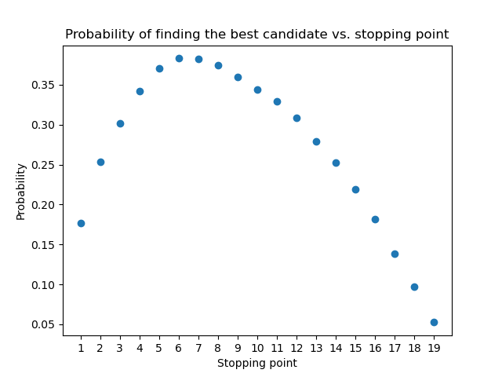
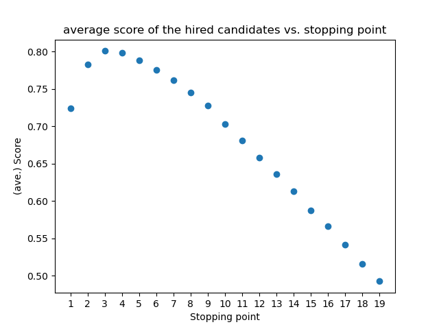

# recruiter-problem

The recuiter problem (also known as the marriage problem, the sultan's dowry problem, the fussy suitor problem, and secretary problem) is a problem that demonstrates a scenario involving optimal stopping theory.

The basic version of the problemn can be stated as follows [[1]](https://en.wikipedia.org/wiki/Secretary_problem): 

* There is a single position to fill.
* There are N applicants for the position, and the value of N is known.
* The applicants, if seen altogether, can be ranked from best to worst unambiguously.
* The applicants are interviewed sequentially in random order, with each order being equally likely.
* Immediately after an interview, the interviewed applicant is either accepted or rejected, and the decision is irrevocable.
* The decision to accept or reject an applicant can be based only on the relative ranks of the applicants interviewed so far.
* The objective of the general solution is to have the highest probability of selecting the best applicant of the whole group. This is the same as maximizing the expected payoff, with payoff defined to be one for the best applicant and zero otherwise.
* A candidate is defined as an applicant who, when interviewed, is better than all the applicants interviewed previously. Skip is used to mean "reject immediately after the interview". Since the objective in the problem is to select the single best applicant, only candidates will be considered for acceptance. The "candidate" in this context corresponds to the concept of record in permutation.

## Optimal stopping point and 1/e law

The optimal strategy for the recruitment problem is a stopping rule: here, the first n candidates are rejected, and after that the candidate who is better than the previous candidates is chosen. Intuitively, one can understand this strategy as explained here: 

* At the beginning the recruiter does not know about the quality of the possible candidates, i.e. it does not know what is the score of a "good" candidate, and what is the score of a "bad" candidate. This problem can be elevated by interviewing more and more candidates; exploring more candidates lead to better understanding of what scores are available in the market. So to gain information about the score distribution of the candidates, the recruiter should interview as many candidates as it can (which means rejecting as many candidates as it can, in our problem).

* Although many rejections leads to good understanding of market, unfortunately it does not leave many candidates to choose from. In other words, if you reject most of the candidates, you have a good idea of what is a good candidate, but not many candidates are left for you to choose from. 

As one can see, here the recruiter should find a balance between **exploring the market** and **exploiting the knowledge** it has. This balance manifests itself in an optimal stopping point for the exploring phase.

Interestingly, one can show that, to maximize the chance of finding the best candidate, one should explore 1/e percent of the candidates (approx. 37 %) at the beginning and then pick the first candidate who is better than the best candidate so far. This is referred to as 1/e law.

In this project, a python code is developed to find the optimal stopping point using a simple Monte-Carlo approach.

## Results 

Here is an example, for which one can see that the 1/e rule applies. Here, we have N=20 candidates, and the probabilty of finding the best candidate reaches its maximum when the first 7-8 candidates are rejected (for exploration reasons).



As a side note, it is worth mentioning that the optimal stopping point would be different if the goal was to maximize the expected score of the chosen candidates (instead of increasing the probability of choosing the best candidate). This has been shown here, in the following figure.



## Requirements
```
python3
numpy 
matplotlib
```

## Running the code
The script is executed with
```
python3 MC.py
```
and produces a graph which shows the probability for finding the best candidate based on the stopping point. 

The key inputs (hard-coded!) are:
```
N_CANDIDATES -- number of candidates that we expect for this job, and
N_HIRINGS -- number hiring trials to find the probabilities (ideally should be infinite).
``` 
Other inputs are:
```
CHOOSING_METHOD -- which can be 'max' or 'mean'. 
It refers to the method with which information is obtained from the data before the stopping point.

DISTRIBUTION -- which can be 'uniform', 'normal', 'pareto'.
It refers to the distribution of the candidates.
```

The example shown in the results sections have the following parameters: 
```
N_HIRINGS = 5_000
N_CANDIDATES = 20
CHOOSING_METHOD = 'max'
DISTRIBUTION = 'random'
```
